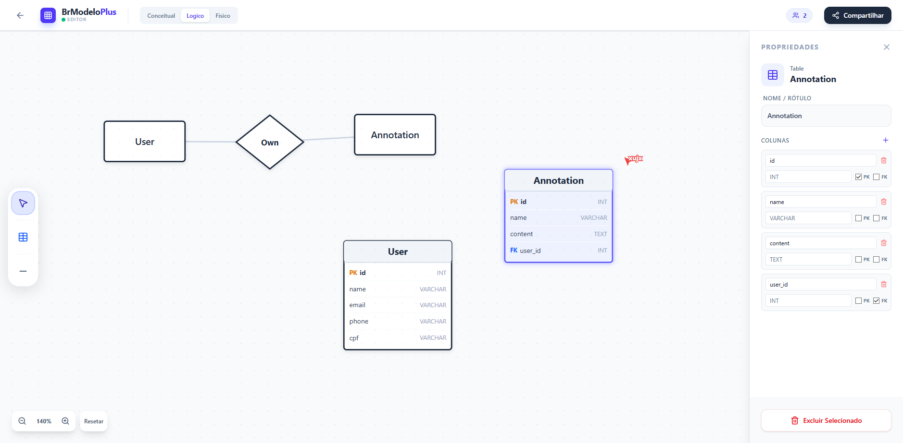

# BrModeloPlus 🗂️

> Modelagem de dados moderna, colaborativa e na nuvem.

**BrModeloPlus** é uma ferramenta web para modelagem de banco de dados, inspirada no clássico brModelo. Desenvolvida com tecnologias modernas, ela permite criar modelos conceituais, lógicos e físicos diretamente no navegador, com suporte a colaboração em tempo real e armazenamento na nuvem.



## ✨ Funcionalidades

O projeto oferece um conjunto robusto de ferramentas para estudantes e profissionais de banco de dados:

- **3 Modos de Modelagem:**
- **Conceitual:** Criação de Entidades (incluindo fracas), Relacionamentos e Atributos (simples, chave, derivado, multivalorado).
- **Lógico:** Conversão e ajuste para estruturas relacionais.
- **Físico:** Definição de tabelas, colunas, tipos de dados, chaves primárias (PK) e estrangeiras (FK).

- **Colaboração em Tempo Real:** Veja cursores de outros usuários e atualizações no diagrama instantaneamente (powered by Firestore).
- **Geração de SQL:** Gera scripts DDL (`CREATE TABLE`) automaticamente a partir do modelo físico.
- **Interface Intuitiva:**
- Drag-and-drop de elementos.
- Zoom e Pan (navegação pelo canvas).
- Painel de propriedades dinâmico.

- **Autenticação Híbrida:** Login via Google ou Acesso Anônimo (Convidado).
- **Gerenciamento de Projetos:** Crie, liste e exclua seus diagramas salvos na nuvem.

---

## 🛠️ Tecnologias Utilizadas

- **Frontend:** [React 19](https://react.dev/), [TypeScript](https://www.typescriptlang.org/)
- **Build Tool:** [Vite](https://vitejs.dev/)
- **Estilização:** [Tailwind CSS v4](https://tailwindcss.com/)
- **Ícones:** [Lucide React](https://lucide.dev/)
- **Backend as a Service (BaaS):** [Firebase](https://firebase.google.com/)
- **Authentication:** Google Auth & Anonymous.
- **Firestore:** Banco de dados NoSQL para sincronização dos diagramas em tempo real.

---

## 🚀 Como Executar o Projeto

### Pré-requisitos

- Node.js (versão 18 ou superior)
- NPM ou Yarn

### 1. Clonar o repositório

```bash
git clone https://github.com/seu-usuario/brmodeloplus.git
cd brmodeloplus
```

### 2. Instalar dependências

```bash
npm install
```

### 3. Configurar o Firebase

Crie um arquivo `.env` na raiz do projeto com as credenciais do seu projeto Firebase (você pode copiar o exemplo abaixo):

```env
VITE_FIREBASE_API_KEY=sua_api_key
VITE_FIREBASE_AUTH_DOMAIN=seu_projeto.firebaseapp.com
VITE_FIREBASE_PROJECT_ID=seu_projeto_id
VITE_FIREBASE_STORAGE_BUCKET=seu_projeto.appspot.com
VITE_FIREBASE_MESSAGING_SENDER_ID=seu_sender_id
VITE_FIREBASE_APP_ID=seu_app_id
```

> **Nota:** No console do Firebase, certifique-se de habilitar:
>
> 1. **Authentication:** Provedores "Google" e "Anônimo".
> 2. **Firestore Database:** Crie o banco e ajuste as regras de segurança para permitir leitura/escrita (para desenvolvimento).

### 4. Rodar o servidor de desenvolvimento

```bash
npm run dev
```

O projeto estará acessível em `http://localhost:5173`.

---

## 📜 Scripts Disponíveis

- `npm run dev`: Inicia o servidor de desenvolvimento.
- `npm run build`: Compila o projeto para produção (via TSC e Vite).
- `npm run lint`: Verifica problemas no código com ESLint.
- `npm run preview`: Visualiza o build de produção localmente.

---

## 🤝 Contribuição

Contribuições são bem-vindas! Sinta-se à vontade para abrir **Issues** ou enviar **Pull Requests**.

1. Faça um Fork do projeto.
2. Crie uma Branch para sua Feature (`git checkout -b feature/IncrivelFeature`).
3. Faça o Commit (`git commit -m 'Add some IncrivelFeature'`).
4. Faça o Push (`git push origin feature/IncrivelFeature`).
5. Abra um Pull Request.

---

## 📝 Licença

Este projeto está sob a licença MIT - veja o arquivo [LICENSE](https://www.google.com/search?q=LICENSE) para detalhes.

---

Feito com ❤️ por [Guilherme Roesler](https://www.google.com/search?q=https://github.com/guilhermeroesler)
