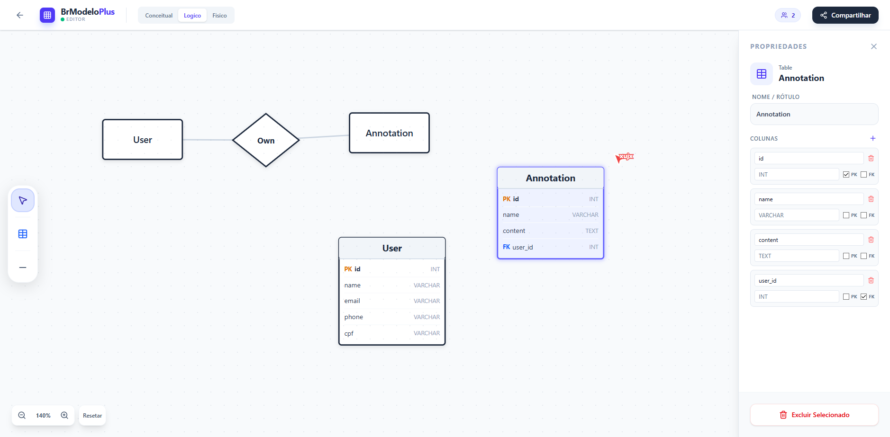

# BrModeloPlus

> Modelagem de dados moderna — conceitual, lógico e físico — no navegador.

**BrModeloPlus** é uma ferramenta web de modelagem de banco de dados, inspirada no clássico brModelo. Permite criar diagramas ER no navegador com persistência em `localStorage`.



## Funcionalidades

- **3 modos de modelagem** — conceitual e lógico com canvas próprios; físico é editor SQL (read-only) derivado do lógico
  - **Conceitual:** entidades (incluindo fracas), relacionamentos e atributos na notação Heuser (haste vertical sob o dono, círculo + rótulo à direita; chave / derivado / multivalorado). Tipo de dados SQL (INTEGER, VARCHAR, DATE…) configurável no painel e propagado para colunas no lógico/físico.
  - **Lógico:** tabelas/FKs geradas a partir do conceitual (somente leitura estrutural).
  - **Físico:** SQL DDL gerado automaticamente (syntax highlight + numeração de linhas + copiar).
- **Editor**
  - Drag-and-drop, zoom (scroll), pan, seleção múltipla (Shift), Delete/Backspace via **React Flow**. Ao arrastar entidade/relacionamento, os atributos ligados vão junto. Controles de zoom + ajustar à tela + minimapa opcional; empty state ilustrado e dicas de atalho no canvas; grade pontilhada; status bar (modo · nós · arestas · salvo).
  - **Header workspace:** nome do projeto editável, indicador de salvo, tabs Conceitual·Lógico·Físico com pill animado, menu ⋯ (import/export JSON + tema claro/escuro).
  - Painel de propriedades (classificação e tipo de dados do atributo, switches, resumo em multi-seleção); no mobile abre como bottom sheet.
  - Toolbar com atalhos **V** (selecionar), **E** (entidade), **R** (relacionamento), **C** (conectar); no mobile fica horizontal na base.
  - **Auto layout** (**ELK.js stress** nos nós estruturais; atributos Heuser em cascata sob o dono).
  - **Conectar:** arrastar handle→handle com preview tracejado e highlight nos nós.
  - **Cardinalidade:** chips nas arestas (clique para ciclar 1, N, (0,1)…); em entidade↔relacionamento o valor fica no lado da entidade. Também editável no painel ao selecionar a aresta.
  - **Enter** (modo conceitual): cria atributo ligado abaixo do dono com edição inline do nome.
  - **Tab** (modo conceitual): com entidade selecionada, cria relacionamento já conectado à direita (edição inline); Tab de novo cria a próxima entidade interligada.
  - Toasts leves para import/export, layout, cópia de SQL e renomear.
- **Geração de SQL:** modo físico exibe `CREATE TABLE` completo com highlight.
- **Import / export JSON:** baixar ou carregar o projeto (conceitual + lógico + físico). No dashboard, importar cria um projeto novo; no editor, importar substitui a sala atual. Arquivos são validados (tamanho máx. 2 MB; schema sanitizado).
- **Projetos:** criar, listar, renomear (no editor) e excluir diagramas (`localStorage`). Dashboard com hero da marca (entrada escalonada), fundo atmosférico animado e cards com miniatura ER e hover.
- **UI:** shadcn/ui (`Button`, `Input`, `Select`, `Badge`, `Separator`, `Card`, `Switch`, `DropdownMenu`, `Tabs`, `ToggleGroup`, `Tooltip`, `Dialog`) no dashboard e no editor; nós do canvas usam os mesmos tokens; tema claro/escuro persistido.
- **Motion / feedback:** Lenis no dashboard; cursor customizado (tokens); hover shadcn; Tabs de modo e painel animados; flash ao criar nó / auto layout. Respeita `prefers-reduced-motion`.

## Tecnologias

- **Frontend:** [React 19](https://react.dev/), [TypeScript](https://www.typescriptlang.org/)
- **Build:** [Vite](https://vitejs.dev/)
- **UI:** [Tailwind CSS v4](https://tailwindcss.com/), [Lucide](https://lucide.dev/), [shadcn/ui](https://ui.shadcn.com/)
- **Motion:** [Lenis](https://github.com/darkroomengineering/lenis) (scroll suave no dashboard), cursor customizado
- **Canvas / layout:** [React Flow](https://reactflow.dev/) (`@xyflow/react`), [ELK.js](https://www.eclipse.org/elk/)

## Como executar

### Pré-requisitos

- Node.js 18+
- npm ou yarn

### 1. Clonar e instalar

```bash
git clone https://github.com/seu-usuario/brmodeloplus.git
cd brmodeloplus
npm install
```

### 2. Dev server

```bash
npm run dev
```

Acesse `http://localhost:5173`. O app abre direto no dashboard. Não é necessário arquivo `.env`.

## Deploy (GitHub Pages)

Push na branch `main` dispara o workflow [`.github/workflows/deploy.yml`](.github/workflows/deploy.yml): build (`npm ci` + `npm run build`) e publicação no GitHub Pages.

**Uma vez no repositório:** Settings → Pages → Build and deployment → Source: **GitHub Actions**.

Site: `https://guilhermeroesler.github.io/brModeloPlus/`

O `base` do Vite (`/brModeloPlus/`) é aplicado só no CI (`GITHUB_ACTIONS`); fora do CI o base continua `/`.

## Estrutura do código

```
public/
  logo.svg / logo.png     # Marca / favicon (ER + Heuser + Plus)
src/
  App.tsx                 # Roteador (dashboard → editor) + CustomCursor
  components/
    ui/                   # shadcn (button, input, select, card, badge, separator, switch, dropdown-menu, tabs, toggle-group, tooltip, dialog) + PropertyInput
    effects/              # Lenis (SmoothScroll), CustomCursor
    dashboard/            # DashboardScreen
    editor/               # Editor + React Flow canvas, toolbar, painéis, status bar, toasts
      flow/               # Nós/edges (tokens shadcn + Heuser)
  config/                 # Constantes e APP_USER
  types/                  # ErNode / ErEdge (React Flow) + Mode/Tool/Project
  lib/                    # SQL, sqlHighlight, theme, localStorage, sanitizeDiagram, autoLayout/ELK, utils (cn)
  services/               # Projetos e salas (localStorage)
  hooks/                  # useAuth, useProjects
```

Spec detalhada para agentes e contribuidores: [`.cursor/skills/brmodelo-plus/SKILL.md`](.cursor/skills/brmodelo-plus/SKILL.md).

## Scripts

- `npm run dev` — servidor de desenvolvimento
- `npm run build` — build de produção (`tsc` + Vite)
- `npm run lint` — ESLint
- `npm run preview` — preview do build

## Contribuição

Contribuições são bem-vindas (Issues e Pull Requests).

1. Fork + branch (`git checkout -b feature/sua-feature`)
2. Implemente a mudança na **camada correta** (ver skill)
3. **Documentação viva:** atualize `.cursor/skills/brmodelo-plus/SKILL.md` e este `README.md` sempre que o comportamento, a arquitetura, o setup ou as funcionalidades mudarem — no mesmo PR
4. `npm run build` ok
5. Abra o Pull Request

## Licença

MIT — veja o arquivo `LICENSE` no repositório.

---

Feito por [Guilherme Roesler](https://github.com/guilhermeroesler)
